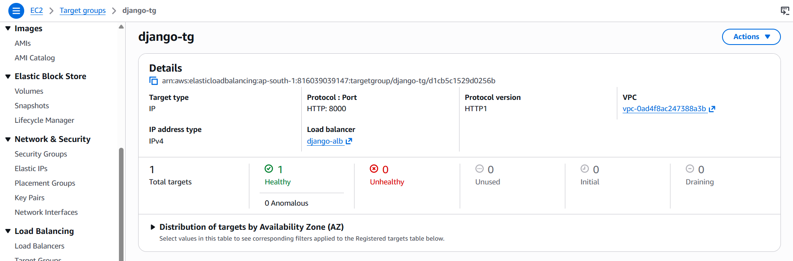
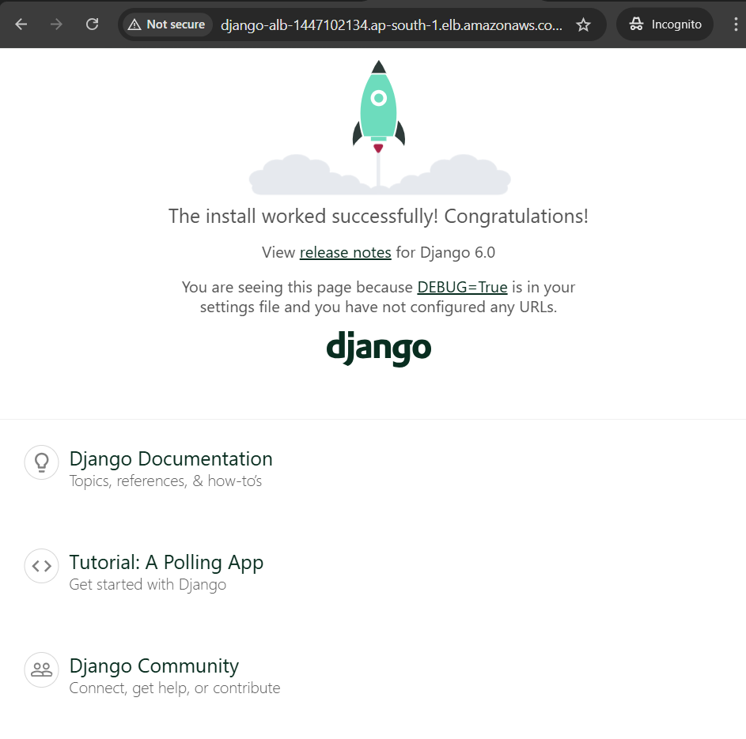

# Django on AWS ECS Fargate

A serverless, containerized Django deployment using AWS ECS Fargate and an Application Load Balancer (ALB).

## Technical Stack
* **Web Framework:** Django (Python)
* **WSGI Server:** Gunicorn
* **Static Files:** WhiteNoise
* **Containerization:** Docker
* **Container Registry:** Amazon ECR
* **Orchestration:** Amazon ECS (Fargate Launch Type)
* **Networking:** Application Load Balancer (ALB), VPC, Security Groups

## Architecture
Traffic enters via **ALB (Port 80)**, which routes to a **Target Group (Port 8000)**. The application runs as a serverless container within an **ECS Cluster** using the **Fargate** launch type.

## Deployment Validation

### 1. Target Group Health Status

### 2. Live Application

## Implementation Steps
1. **Dockerization:** Created Dockerfile for Django/Gunicorn.
2. **Registry:** Managed images via Amazon ECR.
3. **Traffic:** Provisioned ALB and Target Group health checks.
4. **Orchestration:** Configured ECS Task Definitions and Fargate Service.

## Live Link
[http://django-alb-1447102134.ap-south-1.elb.amazonaws.com](http://django-alb-1447102134.ap-south-1.elb.amazonaws.com)

---
**Developed by Seethalakshmi**
